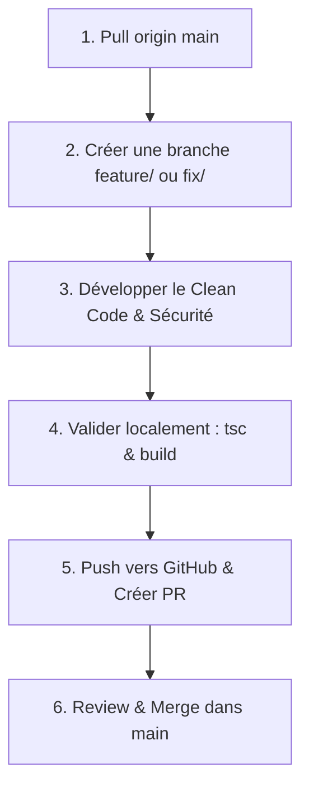

# Guide de Contribution IDLA CMS — Règles & Workflow de Développement

Bienvenue dans le guide de contribution au projet **IDLA CMS**. Ce document définit le workflow officiel obligatoire pour maintenir un code propre, sécurisé et un historique Git structuré.

---

## Cycle de Travail Collaboratif Obligatoire

Pour garantir l'équilibre et la stabilité de la production, tout développeur doit suivre scrupuleusement les 6 étapes ci-dessous.



---

### Étape 1 : Récupérer le travail le plus récent
Avant de commencer toute modification, basculez sur `main` et mettez à jour votre dépôt local avec la dernière version distante.

```bash
git checkout main
git pull origin main
```

---

### Étape 2 : Créer sa branche de travail dédiée
Ne développez **jamais** directement sur la branche `main`. Créez toujours une branche spécifique en respectant la convention de nommage :

- **Nouvelle fonctionnalité** : `feature/nom-de-la-fonctionnalite` (ex: `feature/messagerie-etudiant`)
- **Correction de bug** : `fix/nom-du-bug` (ex: `fix/redirection-login-admin`)
- **Sécurité** : `security/sujet` (ex: `security/appwrite-permissions`)
- **Refactorisation** : `refactor/composant` (ex: `refactor/store-zustand`)

```bash
git checkout -b feature/ma-fonctionnalite
```

---

### Étape 3 : Développer selon les standards Clean Code & Sécurité
Pendant votre développement :
- **Sécurité** : Ne commitez **jamais** de clés d'API (`.env`), ni de fichiers de sauvegarde JSON (`backup*.json`).
- **Permissions Appwrite** : Restreignez les accès aux équipes autorisées (`Role.team('admins')`), n'utilisez jamais `Role.any()` pour l'écriture ou la suppression.
- **Conception** : Évitez les valeurs en dur et réutilisez les helpers partagés dans `src/lib/utils.ts` et `src/lib/dbAdapter.ts`.

---

### Étape 4 : Valider localement le code (Strict)
Avant de commiter ou de pousser votre travail, vous devez impérativement exécuter les vérifications suivantes en local :

```bash
# 1. Vérification stricte des types TypeScript (0 erreur requis)
npx tsc --noEmit

# 2. Build de production Vite (succès requis)
npm run build
```

---

### Étape 5 : Commiter avec des messages structurés
Rédigez des messages de commit clairs au format Conventional Commits :

- `feat(...)`: Nouvel ajout
- `fix(...)`: Correction de bug
- `security(...)`: Correctif de sécurité
- `refactor(...)`: Amélioration de code sans changement fonctionnel
- `docs(...)`: Documentation

```bash
git add .
git commit -m "feat(student): add class chat search filter"
```

---

### Étape 6 : Pousser la branche et ouvrir une Pull Request (PR)
Poussez votre branche sur le dépôt distant GitHub :

```bash
git push -u origin feature/ma-fonctionnalite
```

Ouvrez ensuite la Pull Request via **GitHub CLI (`gh`)** ou l'interface web GitHub :

```bash
gh pr create --title "feat(student): add class chat search filter" --body-file .github/PULL_REQUEST_TEMPLATE.md
```

Remplissez intégralement le formulaire de la Pull Request avec :
1. Le résumé des modifications apportées.
2. La liste des vérifications exécutées.
3. Les captures d'écran de démonstration.

---

## Règles de Validation des PRs & Fusion (Merge)

1. **Revue de code** : Toute PR doit être relue et approuvée avant fusion dans `main`.
2. **Passage de la CI** : Les tests automatiques GitHub Actions (Typecheck & Build) doivent être au vert.
3. **Squash & Merge** : Privilégiez le *Squash and Merge* pour maintenir un historique `main` propre et linéaire.
