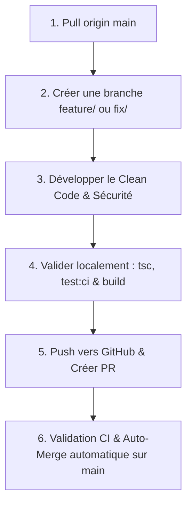

# Guide de Contribution IDLA CMS — Règles & Workflow de Développement

Bienvenue dans le guide de contribution au projet **IDLA CMS**. Ce document définit le workflow officiel obligatoire pour maintenir un code propre, sécurisé et un historique Git structuré.

Pour consulter le guide d'organisation du travail et du pipeline CI/CD automatisé, se référer au fichier **[WORKFLOW.md](../WORKFLOW.md)**.

---

## Cycle de Travail Collaboratif Obligatoire

Pour garantir l'équilibre et la stabilité de la production, tout développeur doit suivre scrupuleusement les 6 étapes ci-dessous.



---

### Étape 1 : Récupérer le travail le plus récent
Avant de commencer toute modification, basculez sur `main` et mettez à jour votre dépôt local avec la dernière version distante.

```bash
git checkout main
git pull origin main
```

---

### Étape 2 : Créer sa branche de travail dédiée
Ne développez **jamais** directement sur la branche `main`. Créez toujours une branche spécifique en respectant la convention de nommage :

- **Nouvelle fonctionnalité** : `feature/nom-de-la-fonctionnalite` (ex: `feature/messagerie-etudiant`)
- **Correction de bug** : `fix/nom-du-bug` (ex: `fix/redirection-login-admin`)
- **Sécurité** : `security/sujet` (ex: `security/appwrite-permissions`)
- **Refactorisation** : `refactor/composant` (ex: `refactor/store-zustand`)

```bash
git checkout -b feature/ma-fonctionnalite
```

---

### Étape 3 : Développer selon les standards Clean Code & Sécurité
Pendant votre développement :
- **Sécurité** : Ne commitez **jamais** de clés d'API (`.env`), ni de fichiers de sauvegarde JSON (`backup*.json`).
- **Permissions Appwrite** : Restreignez les accès aux équipes autorisées (`Role.team('admins')`), n'utilisez jamais `Role.any()` pour l'écriture ou la suppression.
- **Bilinguisme i18n** : Utilisez les fonctions de traduction `t(...)` pour maintenir le support FR / EN.

---

### Étape 4 : Valider localement le code (Strict)
Avant de commiter ou de pousser votre travail, vous devez impérativement exécuter les vérifications suivantes en local :

```bash
# 1. Vérification stricte des types TypeScript (0 erreur requis)
npx tsc --noEmit

# 2. Suite de tests automatisés (12 tests Vitest au vert)
npm run test:ci

# 3. Build de production Vite (succès requis)
npm run build
```

---

### Étape 5 : Commiter et Pousser sa branche
Rédigez des messages de commit clairs au format Conventional Commits :

- `feat(...)`: Nouvel ajout
- `fix(...)`: Correction de bug
- `security(...)`: Correctif de sécurité
- `refactor(...)`: Amélioration de code

```bash
git add .
git commit -m "feat(student): add class chat search filter"
git push -u origin feature/ma-fonctionnalite
```

---

### Étape 6 : Fusion Automatique (Auto-Merge CI/CD)

Dès l'ouverture de la PR vers `main` :
1. GitHub Actions s'exécute automatiquement (`Typecheck & Build Verification`, `Homepage & Core Unit Tests`).
2. Dès que la CI passe au vert (✓ SUCCESS), le script `auto-merge.yml` fusionne directement la PR sur `main` en mode Squash & Merge sans intervention humaine.
