# IDLA — Plateforme d'Admissions & CMS Académique

> **International Distance Learning Academy** — Portail public, espace candidat et console d'administration réunis dans une application web unique, moderne et responsive.

---

## Sommaire

1. [Présentation](#1-présentation)
2. [Comptes & identifiants de test](#2-comptes--identifiants-de-test)
3. [Les trois espaces](#3-les-trois-espaces)
4. [Cas d'utilisation](#4-cas-dutilisation)
5. [Architecture technique](#5-architecture-technique)
6. [Modélisation des données](#6-modélisation-des-données)
7. [Diagrammes de séquence](#7-diagrammes-de-séquence)
8. [Diagrammes d'états](#8-diagrammes-détats)
9. [Installation & exécution](#9-installation--exécution)
10. [Déploiement](#10-déploiement-netlify)
11. [Sécurité & bonnes pratiques](#11-sécurité--bonnes-pratiques-appliquées)
12. [État du projet](#12-état-du-projet)

> Les diagrammes de ce document sont écrits en **Mermaid** : ils se rendent automatiquement sur GitHub, GitLab et dans VS Code (aperçu Markdown).

---

## 1. Présentation

IDLA CMS est la plateforme numérique de l'International Distance Learning Academy. Elle couvre l'intégralité du cycle d'admission d'un établissement d'enseignement supérieur :

- **Vitrine publique** : présentation de l'institut, de ses programmes, de ses actualités et des témoignages d'alumni.
- **Recrutement** : dépôt de candidature en ligne via un formulaire multi-étapes avec téléversement de pièces justificatives.
- **Suivi candidat** : espace personnel où chaque candidat suit l'avancement de son dossier, échange avec son conseiller d'admission et complète ses pièces.
- **Administration (CMS)** : console complète de gestion des contenus, des candidatures, des utilisateurs, des dons et des campagnes marketing.
- **Engagement** : collecte de dons et de témoignages directement depuis le site public, avec circuit de modération côté administration.

L'application fonctionne en **deux modes** : connectée au backend **Appwrite** (données réelles, authentification, stockage de fichiers), ou en **mode autonome** avec des données locales de repli lorsque le backend n'est pas configuré — ce qui permet de la présenter et de la tester sans aucune dépendance externe.

---

## 2. Comptes & identifiants de test

> ⚠️ **Usage strictement réservé aux tests et aux démonstrations.** Ces identifiants ne sont plus affichés nulle part dans l'interface. En production, redéfinissez-les via les variables d'environnement ci-dessous avant d'exécuter le provisionnement, ou changez les mots de passe depuis la console Appwrite.

### 2.1 Comptes de connexion

| Espace | URL de connexion | Email | Mot de passe | Rôle |
|--------|------------------|-------|--------------|------|
| **Administration** | `/admin` | `admin@idla.edu` | `admin123` | Super Admin (membre de l'équipe Appwrite `admins`) |
| **Candidat** | `/candidat` | `jean.dupont@email.com` | `password123` | Candidat |

**Comportement selon le mode :**

- **Backend Appwrite configuré et joignable** : l'authentification passe exclusivement par Appwrite. Ces comptes fonctionnent parce que `npm run appwrite:setup` les crée réellement (compte Auth + adhésion à l'équipe `admins` pour l'administrateur).
- **Mode autonome ou backend injoignable** : un repli local accepte ces mêmes identifiants (et uniquement ceux-ci) afin de pouvoir tester sans backend. Un refus explicite d'Appwrite (mot de passe invalide) n'est **jamais** contourné.

### 2.2 Personnalisation à la création (provisionnement)

| Variable d'environnement | Rôle | Défaut si absente |
|--------------------------|------|--------------------|
| `ADMIN_EMAIL` | Email du compte administrateur créé par le setup | `admin@idla.edu` |
| `ADMIN_PASSWORD` | Mot de passe du compte administrateur | `admin123` |
| `CANDIDATE_EMAIL` | Email du compte candidat de test | `jean.dupont@email.com` |
| `CANDIDATE_PASSWORD` | Mot de passe du compte candidat | `password123` |

### 2.3 Données de test embarquées (mode autonome)

Le fichier `src/data/mockData.ts` fournit le jeu de données de repli : 6 programmes, 5 actualités, 5 témoignages publiés, 2 témoignages en attente de modération, 2 pré-inscriptions complètes (avec motivation et pièces), 3 dons reçus, 3 campagnes marketing, 5 utilisateurs CMS et un journal d'activité. Ces enregistrements servent aussi de **seed** initial lors du provisionnement Appwrite.

---

## 3. Les trois espaces

### 3.1 Portail public (visiteurs)

| Page | Contenu |
|------|---------|
| **Accueil** | Hero immersif, chiffres clés, filières mises en avant, appel au don, pied de page institutionnel |
| **Programmes** | Catalogue filtrable (Master, Doctorat, Bachelor, Certification) avec recherche par mot-clé |
| **Actualités** | Fil d'actualités avec article à la une et filtres par catégorie (Événements, Académique, Partenariats, Annonces, Alumni) |
| **Témoignages** | Galerie de témoignages filtrable + **formulaire public de soumission** (modéré par l'admin avant publication) |
| **Candidature** | Formulaire multi-étapes : identité → parcours académique → pièces justificatives (glisser-déposer) → signature électronique |
| **Faire un don** | Modale de don accessible depuis l'accueil ; les dons sont transmis à l'administration pour confirmation |

### 3.2 Espace candidat

- **Tableau de bord personnalisé** : identité, référence de dossier, programme visé, statut en temps réel.
- **Timeline d'évaluation** en 4 étapes : Soumission → Analyse académique → Entretien oral → Délibération, avec états visuels.
- **Dossier de pièces** : consultation et ajout de documents (PDF, Word), synchronisés avec le stockage Appwrite.
- **Messagerie intégrée** avec la conseillère des admissions, persistée en base.
- Navigation vers les contenus publics (programmes, actualités) **sans quitter l'espace authentifié**.

### 3.3 Console d'administration (CMS)

Console complète avec barre latérale persistante, cloche de **notifications** (journal d'activité avec compteur de non-lus) et profil administrateur dynamique.

| Module | Fonctionnalités |
|--------|-----------------|
| **Dashboard** | KPIs (inscriptions, taux d'admission, dossiers à réviser), demandes récentes, journal d'activité |
| **Utilisateurs** | Recherche, filtres par statut ; **créer, modifier, supprimer** les comptes CMS (Super Admin, Admin, Writer, Marketer, OC) |
| **Programmes** | **CRUD complet** des programmes académiques |
| **Témoignages** | **File de modération** des soumissions publiques (approuver / rejeter) + édition et suppression des témoignages publiés |
| **Actualités** | **CRUD complet** des articles |
| **Pré-inscriptions** | Bouton **« Examiner le dossier »** ouvrant la fiche complète (identité, parcours, motivation, pièces) où se prend la décision |
| **Soutien & Dons** | Réception des dons du site public : KPIs, confirmation de réception, suppression |
| **Marketer** | **CRUD complet** des campagnes : création, édition, activation/pause, suppression |
| **Paramètres** | Profil administrateur, nom du site, ouverture des admissions, notifications |

---

## 4. Cas d'utilisation

### 4.1 Diagramme général des cas d'utilisation

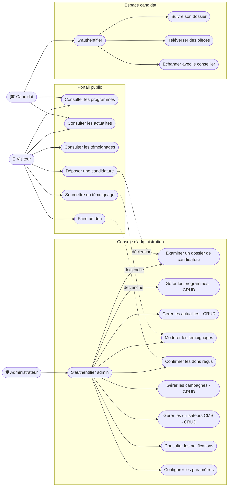

### 4.2 Cas d'utilisation détaillés

#### UC-04 — Déposer une candidature

| | |
|---|---|
| **Acteur principal** | Visiteur |
| **Déclencheur** | Clic sur « Je m'inscris » ou « Je pose ma candidature » |
| **Préconditions** | Aucune (accès public) |
| **Postconditions** | Candidature enregistrée avec le statut `New` ; pièces stockées dans le bucket ; écran de confirmation affiché |

**Scénario nominal :**
1. Le visiteur renseigne son identité (prénom, nom, email, téléphone, nationalité).
2. Il choisit le programme visé et décrit son dernier diplôme.
3. Il téléverse au moins une pièce justificative (glisser-déposer ou sélection, PDF/Word).
4. Il accepte la déclaration sur l'honneur et signe électroniquement.
5. Le système enregistre la candidature (`applications`) et chaque pièce (`candidate_documents` + fichier dans le bucket `documents`).
6. L'écran de confirmation s'affiche avec les prochaines étapes ; le visiteur peut accéder directement au suivi de son dossier.

**Extensions :**
- *1a / 2a. Champ requis manquant* → message d'erreur, blocage du passage à l'étape suivante.
- *3a. Aucune pièce jointe* → blocage avec message explicite.
- *5a. Backend injoignable* → la candidature est conservée localement pour la session ; le parcours se termine normalement.

#### UC-07 — S'authentifier (candidat)

| | |
|---|---|
| **Acteur principal** | Candidat |
| **Préconditions** | Disposer d'un compte (créé via provisionnement ou console Appwrite) |
| **Postconditions** | Rôle `candidate` actif ; tableau de bord chargé avec le dossier lié à l'email |

**Scénario nominal :**
1. Le candidat ouvre `/candidat` et saisit email + mot de passe.
2. Le système purge toute session résiduelle puis crée une session Appwrite.
3. Le tableau de bord charge la candidature liée à l'email, ses documents et sa messagerie.

**Extensions :**
- *2a. Identifiants refusés par Appwrite* → message générique, pas d'accès.
- *2b. Backend injoignable* → repli local accepté uniquement pour le compte de test.
- *3a. Aucune candidature liée* → bandeau invitant à déposer un dossier.

#### UC-10 — Échanger avec le conseiller d'admission

| | |
|---|---|
| **Acteur principal** | Candidat |
| **Préconditions** | UC-07 réalisé |
| **Postconditions** | Messages persistés dans `messages`, rattachés à la candidature |

**Scénario nominal :**
1. Le candidat rédige un message dans le panneau de messagerie.
2. Le message apparaît immédiatement dans le fil et est persisté.
3. La conseillère répond (réponse assistée) ; la réponse est également persistée.

#### UC-11 — S'authentifier (administrateur)

| | |
|---|---|
| **Acteur principal** | Administrateur |
| **Préconditions** | Compte membre de l'équipe Appwrite `admins` |
| **Postconditions** | Rôle `admin` actif ; console CMS chargée (utilisateurs, candidatures, journal) |

**Scénario nominal :**
1. L'administrateur ouvre `/admin` et saisit ses identifiants.
2. Le système purge toute session résiduelle (évite d'hériter d'une session candidat) puis authentifie via Appwrite.
3. Le tableau de bord admin s'affiche ; l'URL devient `/admin/tableau-de-bord`.

**Extensions :**
- *2a. Refus Appwrite* → « Accès refusé », aucun contournement possible.
- *2b. Backend injoignable* → repli local accepté uniquement pour le compte de test.

#### UC-12 — Examiner un dossier de candidature

| | |
|---|---|
| **Acteur principal** | Administrateur |
| **Déclencheur** | Clic sur « Examiner le dossier » (dashboard ou module Pré-inscriptions) |
| **Préconditions** | UC-11 réalisé ; dossier au statut `New` ou `In Review` |
| **Postconditions** | Statut mis à jour (`Accepted` / `Rejected`), répliqué sur Appwrite, journalisé ; le candidat voit sa timeline évoluer |

**Scénario nominal :**
1. L'administrateur ouvre la fiche du dossier : identité, coordonnées, nationalité, diplôme, motivation, pièces justificatives.
2. Il évalue le dossier puis clique « Accepter le candidat » ou « Refuser le dossier ».
3. Le statut est mis à jour, l'action est journalisée, la fiche affiche la décision.

**Extensions :**
- *2a. Décision déjà rendue* → boutons remplacés par un rappel de la décision.

#### UC-15 — Modérer les témoignages

| | |
|---|---|
| **Acteur principal** | Administrateur |
| **Déclencheur** | Soumission publique d'un témoignage (UC-05) |
| **Préconditions** | UC-11 réalisé |
| **Postconditions** | Témoignage publié sur le site public, ou rejeté (supprimé de la file) |

**Scénario nominal :**
1. L'administrateur ouvre le module Témoignages ; la file « En attente de modération » liste les soumissions.
2. Il lit le témoignage et clique « Approuver ».
3. Le témoignage passe dans les publiés, est persisté sur Appwrite et devient visible sur `/temoignages`.

**Extensions :**
- *2a. Contenu inapproprié* → « Rejeter » retire la soumission (journalisé).
- *3a. Correction nécessaire* → l'admin édite un témoignage publié via la modale (nom, fonction, promo, texte).

#### UC-16 — Confirmer un don reçu

| | |
|---|---|
| **Acteur principal** | Administrateur |
| **Déclencheur** | Don soumis via la modale publique (UC-06) |
| **Postconditions** | Don au statut `Confirmé` ; KPIs recalculés |

**Scénario nominal :**
1. Le module Soutien & Dons liste les dons reçus (donateur, email, montant, message, date, statut).
2. L'administrateur vérifie la réception effective puis clique sur ✓ ; le statut passe à `Confirmé`.

#### UC-17 — Gérer les campagnes marketing

| | |
|---|---|
| **Acteur principal** | Administrateur (profil Marketer) |
| **Postconditions** | Campagne créée / modifiée / (dés)activée / supprimée ; statistiques mises à jour |

**Scénario nominal (création) :**
1. « Nouvelle campagne » → saisie du nom, du canal, de la portée estimée.
2. La campagne est créée au statut `Active` et apparaît dans le tableau et les KPIs.

**Extensions :** édition via ✏️ (formulaire pré-rempli), pause/activation par clic sur le badge de statut, suppression via 🗑️.

#### UC-18 — Gérer les utilisateurs CMS

| | |
|---|---|
| **Acteur principal** | Super Admin |
| **Postconditions** | Compte créé / modifié / supprimé, répliqué sur `cms_users`, journalisé |

**Scénario nominal :** recherche/filtrage → « Ajouter un utilisateur » (nom, email, rôle, statut) ou ✏️ pour modifier (rôle, statut, coordonnées) ou 🗑️ pour supprimer.
**Contrainte :** le compte Super Admin principal est protégé contre la suppression.

---

## 5. Architecture technique

### 5.1 Stack

| Couche | Technologie |
|--------|-------------|
| Framework UI | **React 19** + TypeScript 5.8 |
| Build | **Vite 6** |
| Styles | **Tailwind CSS 4** |
| Icônes | Lucide React |
| Backend (BaaS) | **Appwrite** (base de données, authentification, stockage) |
| Tests E2E | Playwright |
| Hébergement | Netlify (`netlify.toml` inclus) |

### 5.2 Diagramme d'architecture

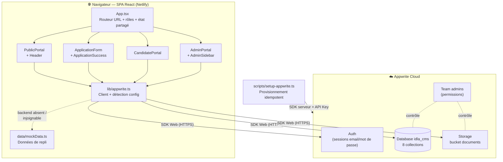

### 5.3 Organisation du code

```
idla-cms/
├── index.html                    # Point d'entrée HTML (métadonnées SEO)
├── netlify.toml                  # Build Netlify + fallback SPA
├── src/
│   ├── App.tsx                   # Routeur (URL ↔ vues), gestion des rôles, état partagé
│   ├── types.ts                  # Types métier (Program, Testimonial, Donation, Campaign…)
│   ├── lib/appwrite.ts           # Client Appwrite centralisé + détection de configuration
│   ├── data/mockData.ts          # Données de repli (mode autonome) + seed du provisionnement
│   └── components/
│       ├── Header.tsx            # En-tête public (visiteurs uniquement)
│       ├── PublicPortal.tsx      # Accueil, programmes, actualités, témoignages + formulaires publics
│       ├── ApplicationForm.tsx   # Candidature multi-étapes
│       ├── ApplicationSuccess.tsx# Confirmation de dépôt
│       ├── CandidatePortal.tsx   # Connexion + tableau de bord candidat
│       ├── AdminPortal.tsx       # Console CMS (tous les modules)
│       └── AdminSidebar.tsx      # Barre latérale (pilotée par le rôle)
└── scripts/
    └── setup-appwrite.ts         # Provisionnement automatisé du backend
```

### 5.4 Navigation & rôles

Routage **par URL** via l'API History (aucune dépendance) : chaque vue a un chemin propre, le rafraîchissement conserve la page, Précédent/Suivant fonctionnent.

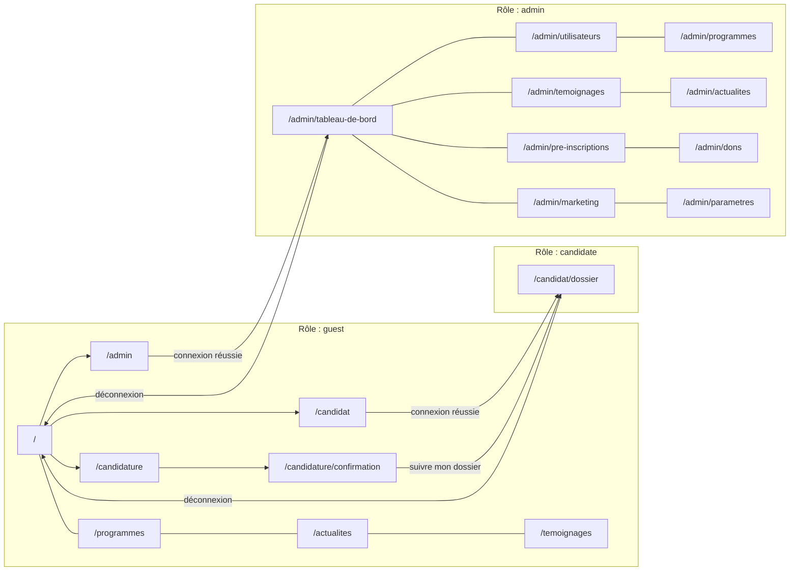

Règles :
- toute vue protégée visitée sans le rôle requis affiche l'écran de connexion correspondant ;
- l'en-tête public disparaît pour les utilisateurs authentifiés (remplacé par la barre latérale de leur espace) ;
- changement de rôle et déconnexion **purgent la session Appwrite** (aucune fuite d'identité entre espaces).

### 5.5 Diagramme de classes (frontend)

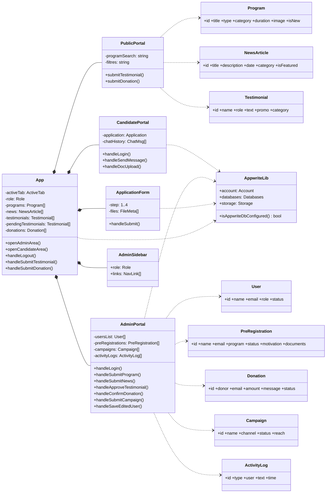

---

## 6. Modélisation des données

### 6.1 Diagramme entité-association (Appwrite — base `idla_cms`)

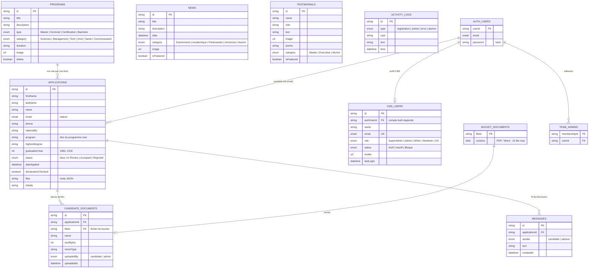

### 6.2 Permissions par collection

| Collection | Lecture | Création | Modification / Suppression |
|------------|---------|----------|----------------------------|
| `programs`, `news`, `testimonials` | **Publique** (`any`) | Équipe `admins` | Équipe `admins` |
| `applications` | Équipe `admins` | **Publique** (dépôt de dossier) | Équipe `admins` |
| `candidate_documents` | Équipe `admins` | **Publique** (pièces du dossier) | Équipe `admins` |
| `messages` | Utilisateurs connectés | Utilisateurs connectés | — |
| `cms_users`, `activity_logs` | Équipe `admins` | Équipe `admins` | Équipe `admins` (logs : création seule) |
| Bucket `documents` | Équipe `admins` | Publique (téléversement) | Équipe `admins` |

> Les collections sensibles (`applications`, `candidate_documents`, `messages`) activent la **sécurité au niveau document**, permettant d'affiner les droits par enregistrement.

### 6.3 Index notables

- `applications.idx_email` — retrouve le dossier d'un candidat connecté.
- `applications.idx_status` — files d'attente de la console admin.
- `cms_users.idx_email_unique` — unicité des comptes CMS.
- Index **fulltext** sur `programs.title`, `news.title`, `testimonials.name` pour la recherche.
- `messages.idx_application` + `idx_created` — fil de discussion chronologique par dossier.

---

## 7. Diagrammes de séquence

### 7.1 Authentification administrateur (avec repli contrôlé)

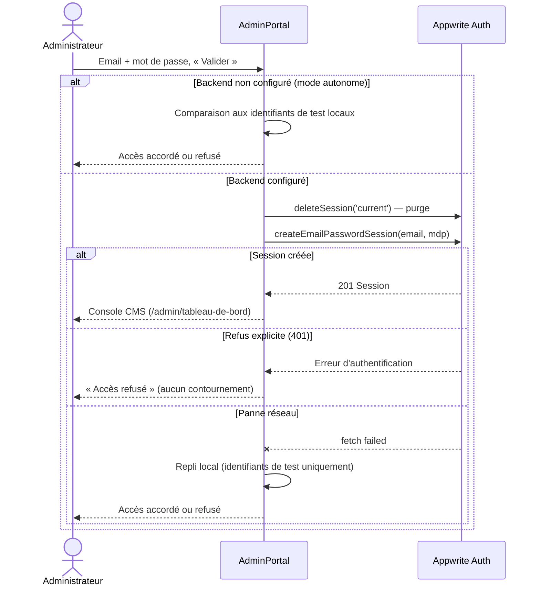

### 7.2 Dépôt de candidature

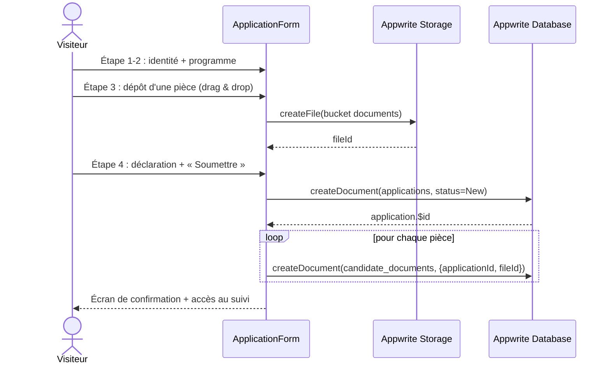

### 7.3 Soumission puis modération d'un témoignage

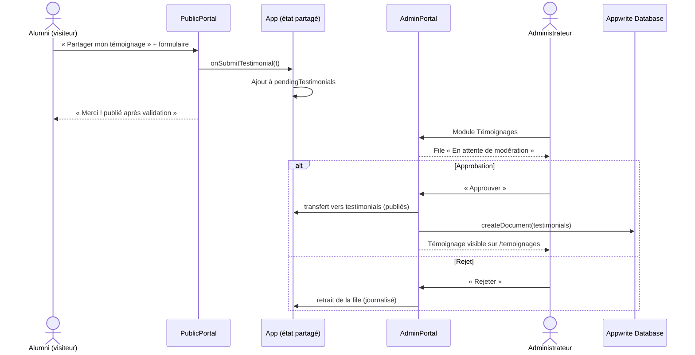

### 7.4 Don public puis confirmation

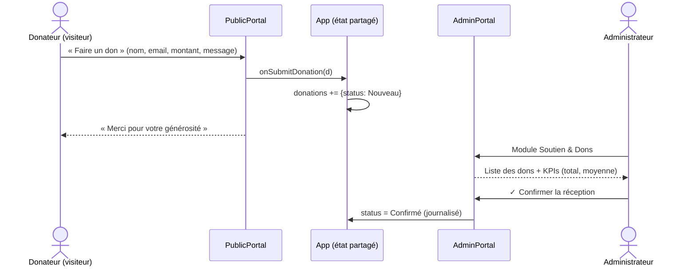

---

## 8. Diagrammes d'états

### 8.1 Cycle de vie d'une candidature

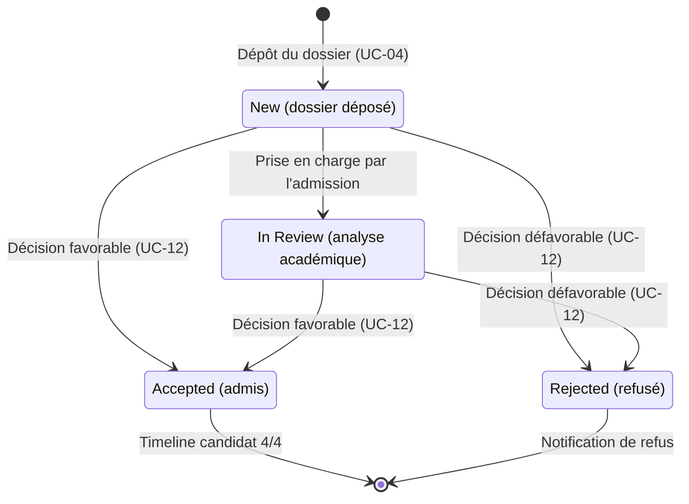

### 8.2 Autres cycles

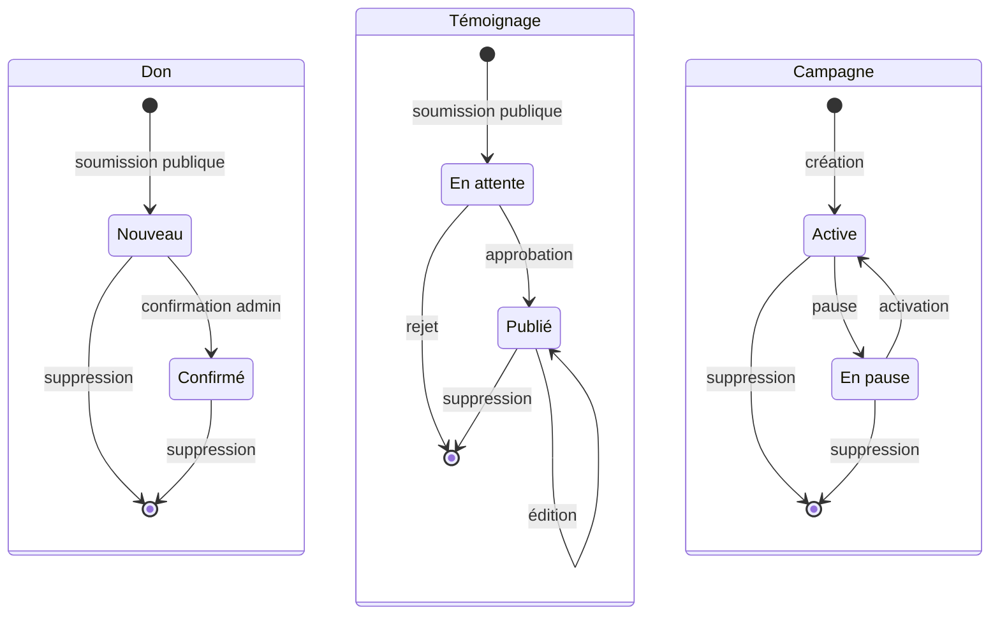

### 8.3 Rôles de session

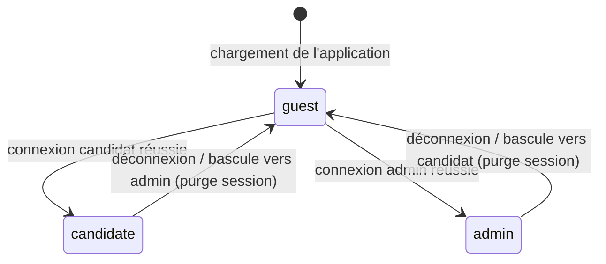

---

## 9. Installation & exécution

### Prérequis

- Node.js 18 ou supérieur

### Démarrage local

```bash
npm install          # Installation des dépendances
npm run dev          # Serveur de développement → http://localhost:3000
npm run lint         # Vérification TypeScript
npm run build        # Build de production → dist/
npm run preview      # Prévisualisation du build
```

### Configuration Appwrite (optionnelle)

1. Copier `.env.example` vers `.env` et renseigner le projet Appwrite (`VITE_APPWRITE_PROJECT_ID`, `VITE_APPWRITE_ENDPOINT`).
2. Créer une clé API serveur (scopes listés dans `.env.example`) et la placer dans `APPWRITE_API_KEY`.
3. Définir si besoin `ADMIN_EMAIL` / `ADMIN_PASSWORD` / `CANDIDATE_EMAIL` / `CANDIDATE_PASSWORD` (cf. §2.2).
4. Lancer `npm run appwrite:setup` — provisionnement **idempotent** de la base, des 8 collections (attributs + index), de l'équipe `admins`, du bucket et du jeu de données initial.
5. Dans la console Appwrite, ajouter le domaine de l'application comme **plateforme Web** (autorisation CORS).

Sans cette configuration, l'application fonctionne intégralement sur ses données locales (§2.3).

---

## 10. Déploiement (Netlify)

Le fichier `netlify.toml` définit la commande de build, le dossier de publication et le **fallback SPA** (toutes les routes servies par `index.html`). À faire dans l'interface Netlify :

1. Déclarer les variables d'environnement `VITE_APPWRITE_*` (Site configuration → Environment variables).
   ⚠️ Ne **jamais** y placer `APPWRITE_API_KEY` : c'est un secret serveur, tout ce qui entre dans le build est lisible publiquement.
2. Ajouter le domaine Netlify comme plateforme Web dans la console Appwrite.
3. Redéployer avec *Clear cache and deploy site*.

---

## 11. Sécurité & bonnes pratiques appliquées

- **Aucun identifiant ni secret affiché** dans l'interface ; messages d'erreur d'authentification génériques.
- Lorsque le backend est configuré, l'authentification passe **exclusivement par Appwrite** : un refus du serveur n'est jamais contourné côté client. Le repli local n'existe qu'en mode autonome ou en cas de panne réseau (cf. §7.1).
- Les comptes provisionnés sont configurables via `ADMIN_EMAIL` / `ADMIN_PASSWORD` et `CANDIDATE_EMAIL` / `CANDIDATE_PASSWORD` — **à définir avec des mots de passe forts en production** (§2.2).
- `.env` exclu du dépôt (`.gitignore`) ; seules les variables `VITE_*` (publiques par nature) sont exposées au navigateur.
- Permissions Appwrite **par équipe** (`admins`) et **par document** pour les collections sensibles (§6.2).
- Vues d'administration et de candidat **gardées par rôle** ; purge de session à chaque changement d'espace (§8.3).
- Contenus soumis par le public (témoignages) **modérés avant publication** (§7.3).
- Dégradation contrôlée : indisponibilité du backend → bascule silencieuse sur les données locales, sans écran d'erreur.

---

## 12. État du projet

| Vérification | Statut |
|--------------|--------|
| Typecheck (`tsc --noEmit`) | ✅ Sans erreur |
| Build de production (Vite) | ✅ ~479 kB JS (128 kB gzip) |
| Parcours E2E (Playwright) | ✅ Navigation, authentifications (nominal + refus + repli), CRUD admin, formulaires publics, modération |
| Déploiement | ✅ Netlify (SPA fallback configuré) |

### Pistes d'évolution

- Authentification candidat auto-provisionnée à la soumission du dossier (compte Appwrite + email transactionnel).
- Éditeur riche pour les actualités et téléversement d'images vers le bucket.
- Notifications temps réel via Appwrite Realtime.
- Pagination et exports (CSV) sur les listes d'administration.
- Tableau de bord analytique branché sur les données réelles.

---

*Document de présentation — IDLA CMS. Rédigé à partir de l'état effectif du code et du schéma de provisionnement (`scripts/setup-appwrite.ts`).*
